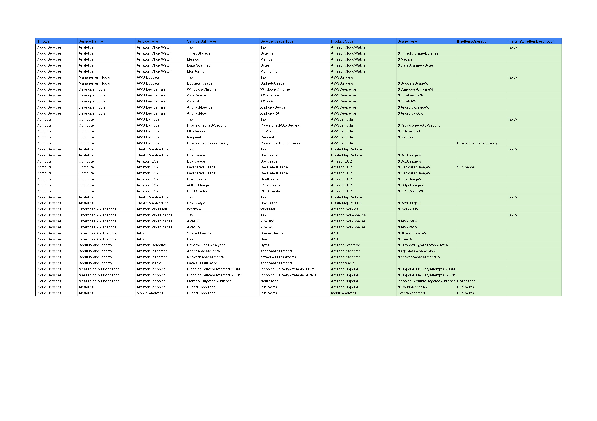

# Лабораторная работа 1. Знакомство с IaaS, PaaS, SaaS сервисами в облаке на примере Amazon Web Services (AWS). Создание сервисной модели.

## Цель работы

Знакомство с облачными сервисами. Понимание уровней абстракции над инфраструктурой в облаке. Формирование понимания
типов потребления сервисов в сервисной-модели.

## Дано

* Слепок данных биллинга от провайдера после небольшой обработки в виде SQL-параметров. Символ % в начале/конце
  означает, что перед/после него может стоять любой набор символов.
* Образец итогового соответствия, что желательно получить в конце.

Таблица ДО:

## Необходимо

* Импортировать файл .csv в Excel или любую другую программу работы с таблицами. Для Excel делается на вкладке Данные –
  Из текстового / csv файла – выбрать файл, разделитель – точка с запятой.
* Распределить потребление сервисов по иерархии, чтобы можно было провести анализ от большего к меньшему (напр. От всех
  вычислительных ресурсов Compute дойти до конкретного типа использования - Выделенной стойка в датацентре Dedicated
  host usage).
* Сохранить файл и залить в соответствующую папку на Google Drive.

## Алгоритм работы

Сопоставить входящие данные от провайдера с его же документацией. Написать в соответствие колонкам справа значения 5
колонок слева, которые бы однозначно классифицировали тип сервиса. Для столбцов IT Tower и Service Family значения можно
выбрать из образца.

## Ход работы

### Заполнение данных

По таблице мой вариант оказался 4-м. Я изучил слепок биллинга, это оказался модифицированный AWS CUR.  
Итоговую таблицу можно посмотреть в [PDF](img/AWS_CUR.pdf)

### Описание сервисов

Для заполнения таблицы надо было понять что из себя представляет каждый сервис. Во время анализа сервисов была придумана
шуточная и очень условная система оценивания сложности:  
🤪 - относительно просто. Можно использовать с минимальными знаниями админства/DevOps  
🤓 - Сложно, для продвинутых смешариков  
🤑 - Для pet проектов перебор. Корпоративное использование

#### Amazon CloudWatch 🤓

Amazon CloudWatch — это сервис мониторинга и управления ресурсами AWS, а также приложениями, работающими на AWS. Он
собирает и отслеживает метрики, логи и события, позволяя пользователям получать информацию о состоянии и
производительности своих ресурсов в реальном времени.

#### AWS Budgets 🤪

AWS Budgets предоставляет инструменты для установки бюджетов расходов и отслеживания их выполнения. Сервис позволяет
создавать оповещения, когда расходы или использование сервисов приближаются к установленным лимитам, помогая
контролировать затраты и избегать неожиданных расходов.

#### AWS Device Farm 🤓

AWS Device Farm — это сервис для тестирования мобильных и веб-приложений на реальных устройствах в облаке. Он позволяет
разработчикам выявлять и исправлять ошибки, обеспечивая качество приложений на различных платформах и устройствах без
необходимости физического доступа к ним. Проводить автоматизированные тестирование на множестве различных устройств, а
также внедрять тестирование в CI/CD пайплайны.

#### AWS Lambda 🤓

AWS Lambda — это бессерверная вычислительная служба, которая позволяет запускать код в ответ на события без управления
серверами. Пользователи платят только за время выполнения кода, что делает Lambda идеальным решением для создания
масштабируемых и экономичных приложений.

#### Elastic MapReduce (Amazon EMR) 🤑

Elastic MapReduce (EMR) — это сервис для обработки больших данных с использованием фреймворков, таких как Apache Hadoop
и Apache Spark. EMR упрощает развертывание, управление и масштабирование кластеров для анализа больших объемов данных,
обеспечивая высокую производительность и гибкость.

#### Amazon EC2 (Elastic Compute Cloud) 🤓

Amazon EC2 предоставляет масштабируемые вычислительные мощности в облаке, позволяя пользователям запускать виртуальные
серверы с различными конфигурациями. Сервис поддерживает широкий спектр операционных систем и приложений, обеспечивая
гибкость и контроль над инфраструктурой.

#### Amazon WorkMail 🤪

Amazon WorkMail — это управляемый корпоративный сервис электронной почты и календаря, обеспечивающий безопасность и
совместимость с существующими почтовыми клиентами. Он интегрируется с другими сервисами AWS, предоставляя пользователям
надежное и удобное решение для управления электронной корреспонденцией.

#### Amazon WorkSpaces 🤓

Amazon WorkSpaces предоставляет виртуальные рабочие столы в облаке, позволяя пользователям получать доступ к своим
приложениям и данным с любого устройства. Сервис обеспечивает безопасное и масштабируемое решение для удаленной работы,
упрощая управление рабочими средами.

#### A4B 🤑

A4B - сервис про который мало информации. Похоже на сокращение Alexa for Business.

#### Amazon Detective 🤑

Amazon Detective — это сервис для упрощения процесса расследования потенциальных угроз безопасности. Он автоматически
собирает и анализирует данные из различных источников AWS, предоставляя визуализацию связей и помогающую быстро выявлять
и устранять инциденты безопасности.

#### Amazon Inspector 🤑

Amazon Inspector — это автоматизированный сервис оценки безопасности, который помогает выявлять уязвимости и нарушения
лучших практик в приложениях, развернутых на AWS. Он проводит анализы на основе заданных правил и предоставляет
рекомендации для улучшения безопасности инфраструктуры.

#### Amazon Macie 🤑

Amazon Macie использует машинное обучение для автоматического обнаружения, классификации и защиты конфиденциальных
данных в AWS. Сервис помогает идентифицировать и контролировать доступ к чувствительной информации, такой как
персональные данные, обеспечивая соответствие требованиям безопасности и конфиденциальности.

#### Amazon Pinpoint 🤑

Amazon Pinpoint — это сервис для управления маркетинговыми кампаниями и взаимодействием с пользователями через различные
каналы, такие как электронная почта, SMS и push-уведомления. Он предоставляет инструменты для сегментации аудитории,
аналитики и автоматизации процессов коммуникации, помогая компаниям эффективно взаимодействовать с клиентами.
Сервис может использоваться как для маркетинговых, так и для системных сообщений, например для двухфакторной
аутентификации.

#### Mobile Analytics 🤑

Mobile Analytics — это инструмент для сбора и анализа данных о взаимодействии пользователей с мобильными приложениями.
Сервис позволяет отслеживать поведение пользователей, оценивать производительность приложений и принимать решения на
основе полученных аналитических данных для улучшения пользовательского опыта.

## Вывод

В ходе работы было изучено много нового про сервисы AWS. Полученные знания позволили заполнить табличку биллинга и
проанализировать сложность каждого сервиса. Как неудивительно, большинство сервисов из биллинга для использования
требует хороших знаний в области DevOps, а часть применима только в рамках корпоративного использования. Так-то логично,
AWS больше B2B, а не B2C)

