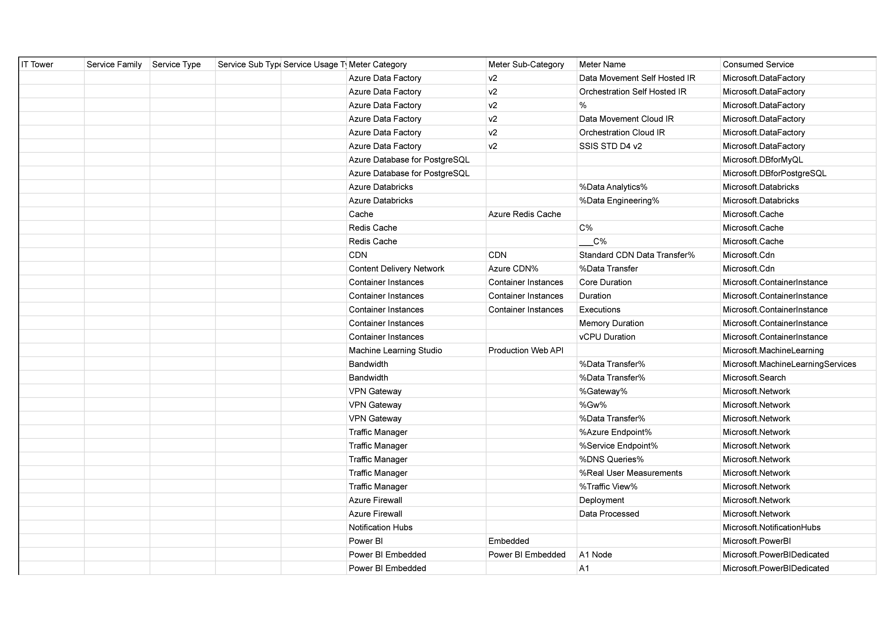
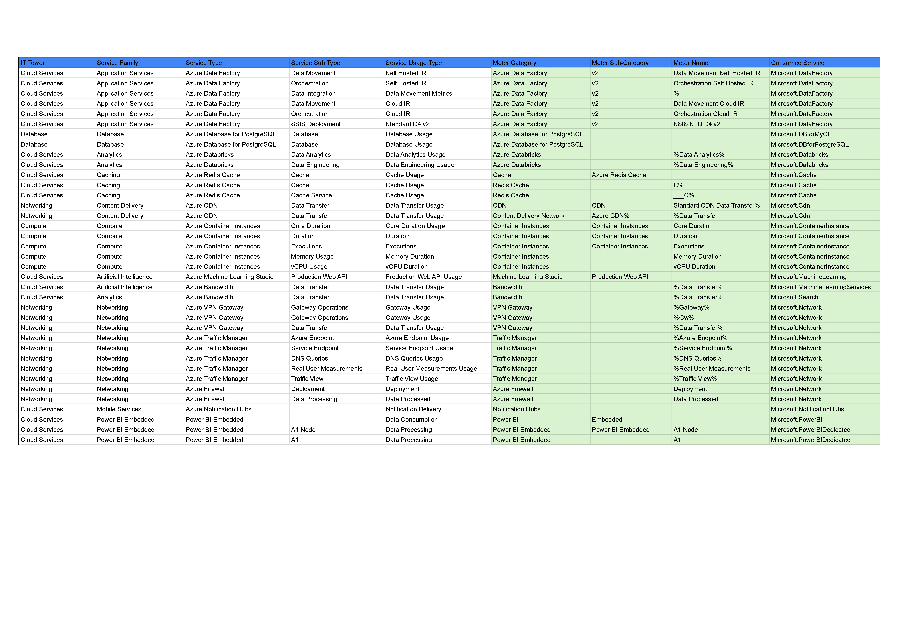

# Лабораторная работа 2. Сравнение сервисов Amazon Web Services и Microsoft Azure. Создание единой кросс-провайдерной сервисной модели

## Цель работы

Получение навыков аналитики и понимания спектра публичных облачных сервисов без привязки к вендору. Формирование у
студентов комплексного видения Облака.

## Дано

* Данные лабораторной работы 1.
* Слепок данных биллинга от провайдера после небольшой обработки в виде SQL-параметров. Символ % в начале/конце
  означает, что перед/после него может стоять любой набор символов.
* Образец итогового соответствия, что желательно получить в конце.

Таблица ДО:

## Необходимо

* Импортировать файл .csv в Excel или любую другую программу работы с таблицами. Для Excel делается на вкладке Данные –
  Из текстового / csv файла – выбрать файл, разделитель – точка с запятой.
* Распределить потребление сервисов по иерархии, чтобы можно было провести анализ от большего к меньшему (напр. От всех
  вычислительных ресурсов Compute дойти до конкретного типа использования - Выделенной стойка в датацентре Dedicated
  host usage). При этом сохранять логическую концепцию, выработанную в Лабораторной работе 1.
* Сохранить файл и залить в соответствующую папку на Google Drive.

## Алгоритм работы

Сопоставить входящие данные от провайдера с его же документацией. Написать в соответствие колонкам справа значения 5
колонок слева, которые бы однозначно классифицировали тип сервиса. Для столбцов IT Tower и Service Family значения можно
выбрать из образца. В ходе выполнения работы не отходить от принципов классификации, выбранных в Лабораторной работе 1.
Например, если сервис Машинного обучения был разбит на Вычислительные мощности и Облачные сервисы, то продолжать его
разбивать и в новых данных.

## Ход работы

### Заполнение данных таблицы

Вариант тот же, 4-й.  
Итоговую таблицу можно посмотреть в [PDF](img/Azure.pdf)

### Описание сервисов

Для заполнения таблицы надо было понять что из себя представляет каждый сервис.
Решил продолжить ввести оценку "сложности":  
🤪 - относительно просто. Можно использовать с минимальными знаниями админства/DevOps  
🤓 - Сложно, для продвинутых смешариков  
🤑 - Для pet проектов перебор. Корпоративное использование

#### Azure Data Factory 🤓

Azure Data Factory — это облачный сервис интеграции данных, позволяющий создавать, планировать и управлять процессами
извлечения, трансформации и загрузки данных из различных источников. Он поддерживает как локальные, так и
облачные интеграционные раннеры, обеспечивая гибкость и масштабируемость для обработки больших объемов данных.

#### Azure Database for PostgreSQL 🤪

Azure Database for PostgreSQL — это управляемый сервис базы данных PostgreSQL в облаке Azure, предоставляющий высокую
доступность, безопасность и автоматическое масштабирование. Сервис упрощает развертывание и управление PostgreSQL,
позволяя разработчикам фокусироваться на создании приложений без необходимости заботиться о инфраструктуре базы данных.

#### Azure Databricks 🤓

Azure Databricks — это аналитическая платформа на основе Apache Spark, разработанная совместно Microsoft и Databricks.
Она предоставляет интегрированную среду для обработки больших данных, машинного обучения и аналитики, обеспечивая
высокую производительность и удобство совместной работы для аналитиков и разработчиков.

#### Azure Redis Cache 🤪

Azure Redis Cache — это управляемый сервис кеширования на основе Redis, обеспечивающий высокую производительность и
низкую задержку для приложений. Он используется для ускорения доступа к данным, уменьшения нагрузки на базы данных и
обеспечения масштабируемости приложений за счет эффективного управления кешем в памяти.

#### Azure CDN (Content Delivery Network) 🤓

Azure CDN — это глобальная сеть доставки контента, предназначенная для ускорения загрузки веб-сайтов, приложений и видео
за счет кэширования контента на серверах, расположенных ближе к пользователям. Сервис улучшает производительность и
доступность контента, снижая время отклика и повышая удовлетворенность пользователей.

#### Azure Container Instances 🤓

Azure Container Instances (ACI) — это сервис для быстрого развертывания контейнеров без необходимости управления
виртуальными машинами или оркестраторами контейнеров. ACI обеспечивает масштабируемость и гибкость для запуска
контейнеризированных приложений, упрощая процесс разработки и развертывания микросервисов.

#### Azure Machine Learning Studio 🤓

Azure Machine Learning Studio — это интегрированная среда для разработки, обучения и развертывания моделей машинного
обучения. Сервис предоставляет инструменты для подготовки данных, построения моделей и их оценки, а также возможности
для автоматизации процессов машинного обучения, что ускоряет создание интеллектуальных приложений.

#### Azure VPN Gateway 🤓

Azure VPN Gateway — это сервис, обеспечивающий безопасное подключение между локальной сетью и виртуальными сетями в
Azure через VPN-туннели. Он поддерживает различные типы VPN, включая точка-точка и мультисайтные подключения,
обеспечивая надежную и защищенную связь для гибридных облачных решений.

#### Azure Traffic Manager 🤑

Azure Traffic Manager — это сервис управления трафиком, который распределяет входящие запросы пользователей между
несколькими сервисами, расположенными в разных географических регионах. Он улучшает производительность и доступность
приложений за счет балансировки нагрузки, географического маршрутизации и отказоустойчивости.

#### Azure Firewall 🤓

Azure Firewall — это управляемый сетевой сервис безопасности, предоставляющий централизованный контроль над входящим и
исходящим трафиком в виртуальных сетях Azure. Сервис поддерживает фильтрацию на основе правил, защиту от угроз и
интеграцию с другими сервисами безопасности Azure, обеспечивая комплексную защиту инфраструктуры.

#### Azure Notification Hubs 🤪

Azure Notification Hubs — это масштабируемый сервис доставки уведомлений, предназначенный для отправки push-уведомлений
на мобильные устройства и веб-приложения. Он поддерживает различные платформы, включая iOS, Android и Windows, и
позволяет отправлять персонализированные и массовые уведомления с высокой производительностью.

#### Power BI Embedded 🤑

Power BI Embedded — это аналитический сервис, позволяющий разработчикам интегрировать интерактивные отчеты и дашборды
Power BI непосредственно в свои приложения. Сервис предоставляет мощные инструменты для визуализации данных, позволяя
пользователям получать инсайты и принимать обоснованные решения без необходимости покидать приложение.

## Вывод

В ходе выполнения лабораторной работы я еще раз прикоснулся к сервисам Azure. Мой первый опыт был пару лет назад и он
был негативный, т.к. интерфейс Azure не интуитивный. Сейчас он мне также кажется не интуитивным, но местами даже
логичным. Данная лабораторная работа содержит более простые сервисы чем были представлены в AWS. Может быть поэтому
работа с Azure кажется проще, чем с AWS.

