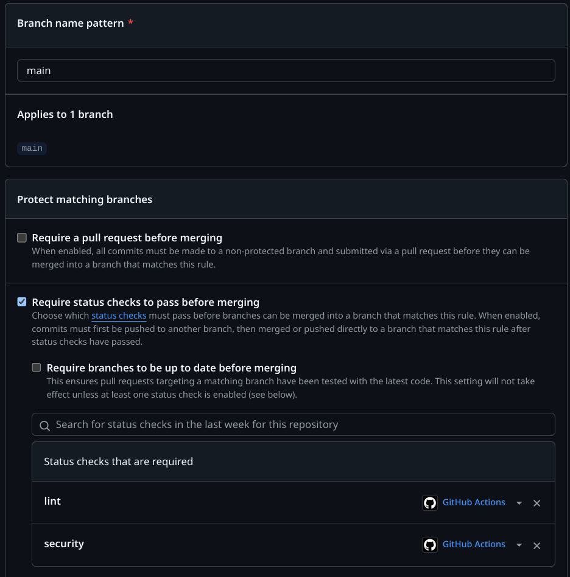
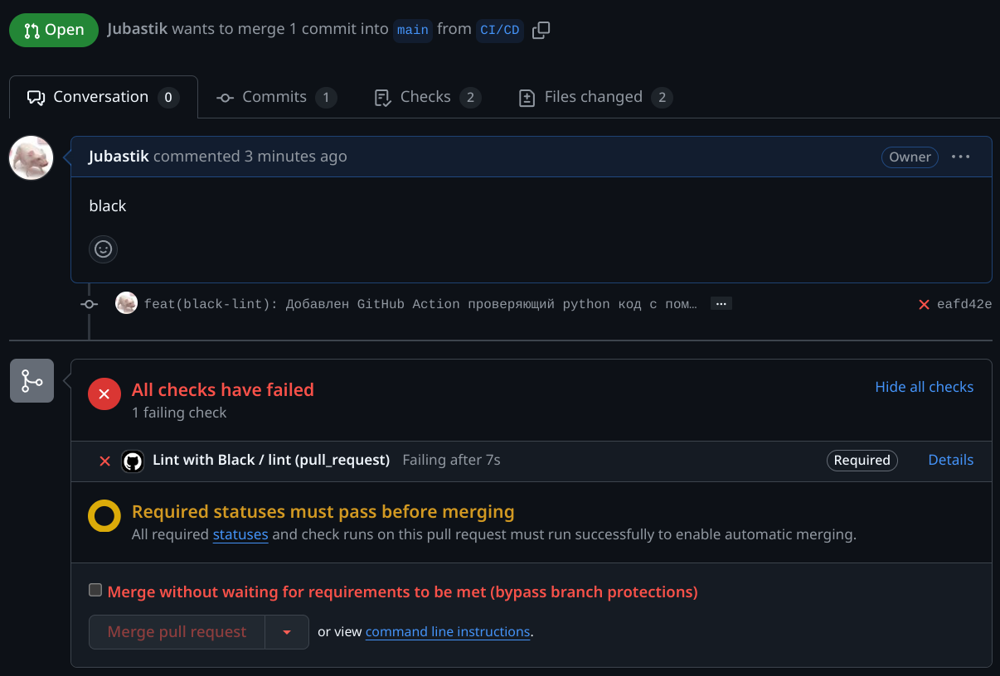
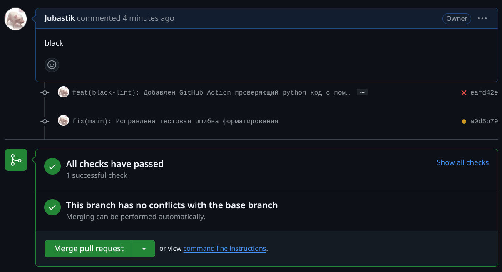
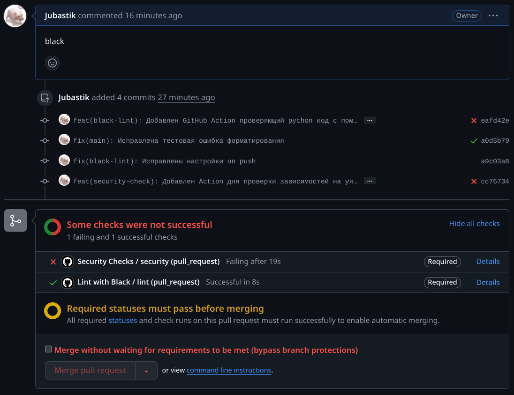
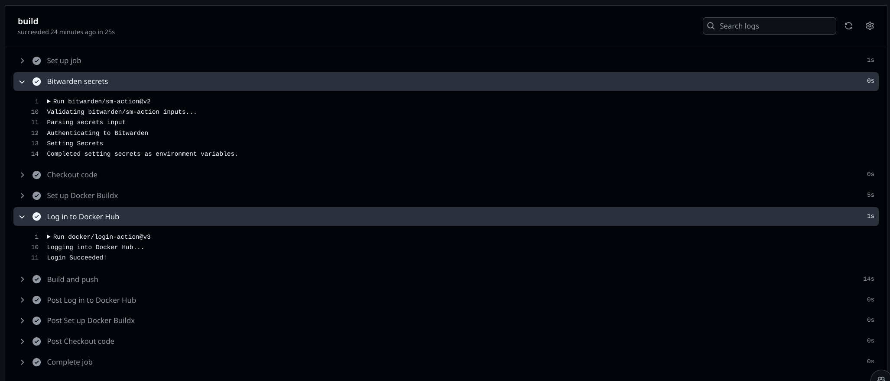

1. Краткое описание
2. GithubActions  
   2.1 Описание    
   2.2 Black  
   2.3 Security  
   2.4 Docker push
3. Best practices  
   3.1 Разделение на стадии  
   3.2 Фиксирование версий  
   3.3 Оптимизация триггеров  
   3.4 Описание для шагов  
   3.5 Таймауты
4. Внешнее хранилище секретов

## 1. Краткое описание

Для решения лабораторной работы были взяты два FastApi приложения из лабораторной работы №2.
CI/CD настроен на Github Actions. Состоит из 3 шагов:

- Black - проверка кода на соответствие стандарту pep8
- Security - проверка кода на наличие уязвимостей с помощью python библиотеки safety
- Docker push - сборка и пуш образа на DockerHub

## 2. GithubActions

### 2.1 Описание

Actions находятся в папке .github/workflows.
В репозитории настроена защита ветки main. Если Action lint или security не пройдет, то пушить в main будет нельзя.



### 2.2 Black

```yaml
name: Lint with Black

on:
  push:
    branches:
      - main
  pull_request:
    branches:
      - main

jobs:
  lint:
    runs-on: ubuntu-24.04

    steps:
      - name: Checkout repository
        uses: actions/checkout@v4

      - name: Set up Python
        uses: actions/setup-python@v5
        with:
          python-version: '3.12'

      - name: Install dependencies
        run: |
          python -m pip install --upgrade pip
          pip install black

      - name: Run Black
        run: black . --check --diff
```

Попытка пуша с нарушением стандарта pep8:


Исправление стандарта pep8:


### 2.3 Security

```yaml
name: Security Checks

on:
  push:
    branches:
      - main
  pull_request:
    branches:
      - main

jobs:
  security:
    runs-on: ubuntu-24.04

    steps:
      - name: Checkout code
        uses: actions/checkout@v4

      - name: Set up Python
        uses: actions/setup-python@v5
        with:
          python-version: '3.12'

      - name: Install dependencies
        run: |
          python -m pip install --upgrade pip
          pip install safety

      - name: Check vulnerabilities
        run: |
          safety check -i 70612 --full-report
           # -i 70612 - игнорировать уязвимость в самой safety 🤡
```

Попытка пуша с уязвимостью:


Исправление уязвимости:


### 2.4 Docker push

Для автоматического пуша использую специальный тег ci_cd.  
Образы с этим тегом можно например автоматически подтягивать в dev
контуре. А стабильные версии все же ручками пушить и проставлять нормальные теги.

```yaml
name: Build and Push Docker Image

on:
  push:
    branches:
      - CI/CD

jobs:
  build:
    runs-on: ubuntu-24.04
    timeout-minutes: 20

    steps:
      - name: Bitwarden secrets
        uses: bitwarden/sm-action@v2
        with:
          access_token: ${{ secrets.BW_ACCESS_TOKEN }}
          base_url: https://vault.bitwarden.com
          secrets: |
            c7ba33b0-14d6-4aae-9c06-b20f010dab86 > DOCKERHUB_USERNAME
            7998fe1d-dcc5-4613-ac5d-b20f010cb5ed > DOCKERHUB_TOKEN


      - name: Checkout code
        uses: actions/checkout@v4

      - name: Set up Docker Buildx
        uses: docker/setup-buildx-action@v3

      - name: Log in to Docker Hub
        uses: docker/login-action@v3
        with:
          username: ${{ env.DOCKERHUB_USERNAME }}
          password: ${{ env.DOCKERHUB_TOKEN }}

      - name: Build and push
        run: |
          cd app1
          docker build -t jubastik/itmo-ops-labs:ci_cd .
          docker push jubastik/itmo-ops-labs:ci_cd

```

Удачный пуш:

Да, лаба пылилась месяц... Бывает 🤷‍♂️

## 3. Best practices

### 3.1 Разделение на стадии

Каждый логический блок должен выполнятся в своей джобе и находится в своем файле. Это облегчит поддержку и отладку.

### 3.2 Фиксирование версий

Фиксирование версий действий не позволит джобе "взять и сломаться" из-за обновления

Плохо:

```yaml
steps:
  - uses: actions/checkout@latest
```

Хорошо:

```yaml
steps:
  - uses: actions/checkout@v4
```

### 3.3 Оптимизация триггеров

Надо смотреть по ситуации. Если джоба не нужна на коммит в ветке playground, то и не надо ее запускать.

Плохо:

```yaml
on: push
```

Хорошо:

```yaml
on:
  push:
    branches:
      - main
      - release/*
```

### 3.4 Описание для шагов

Отсутствие комментариев в джобе может привести к тому, что через месяц можно не понять что она делает.

Плохо:

```yaml
steps:
  - uses: actions/checkout@v4
  - uses: actions/setup-python@v5
    with:
      python-version: '3.12'
```

Хорошо:

```yaml
    steps:
      - name: Checkout code
        uses: actions/checkout@v4

      - name: Set up Python
        uses: actions/setup-python@v5
        with:
          python-version: '3.12'
```

### 3.5 Таймауты

Время деньги. Если что-то пойдет не так, то джоба может выполняться 6 часов пока ее не убьет Github.

Плохо:

```yaml
  security:
    runs-on: ubuntu-24.04
```

Хорошо:

```yaml
  security:
    runs-on: ubuntu-24.04
    timeout-minutes: 10
```

## 4. Внешнее хранилище секретов

Хранение секретов во внешнем хранилище (далее хранилище) имеет много преимуществ по сравнению с хранением в переменных
CI/CD.  
И нет, хранилище не безопаснее переменных CI/CD, если секреты утекают через уязвимость в приложении. Их также можно
прочитать через переменные окружения. Однако:

- Хранилище позволяет гибко настраивать доступ к секретам. Можно создать множество групп, пользователей, токенов
  доступа. Это позволяет выдавать минимально необходимую информацию конечному приложению.
- Хранилища благодаря гибкой настройки позволяют автоматизировать обновление секретов. Даже если секрет утек, то через
  некоторое время он будет обнулен и заменен на новый. Причем на стороне пользователя секрета ничего делать не надо.
- Хранилища могут быть запущены внутри корпоративного контура. Это в купе с локальными CI/CD ранером позволяет
  минимизировать риски утечки секретов через уязвимости GitHub. Также в некоторых компаниях запрещено хранить секюрную
  информацию в "облаке".
- Популярные хранилища имеют большое количество интеграций. Это удобно.

Я использовал Bitwarden. Популярное open-source хранилище секретов. Благодаря удобной интеграции с Github Actions
подключить его не составило труда. Надо только добавить Bitwarden токен в CI/CD секреты.

Код:

```yaml
- name: Bitwarden secrets
  uses: bitwarden/sm-action@v2
  with:
    access_token: ${{ secrets.BW_ACCESS_TOKEN }}
    base_url: https://vault.bitwarden.com
    secrets: |
      c7ba33b0-14d6-4aae-9c06-b20f010dab86 > DOCKERHUB_USERNAME
      7998fe1d-dcc5-4613-ac5d-b20f010cb5ed > DOCKERHUB_TOKEN
```

Необходимые переменные можно получить так:

```yaml
with:
  username: ${{ env.DOCKERHUB_USERNAME }}
  password: ${{ env.DOCKERHUB_TOKEN }}
```


