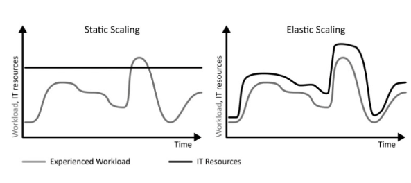

# Вариант 4

## Работа 1

**Можно ли в 2020 году назвать датацентр частным облаком? Расскажите почему**.

Кратко - нет. Это как сравнивать бетон и здание. Вещи разные, но связанные.

Для начала что такое **датацентр**? Это просто физическая инфраструктура (и админы), которая может быть использована для
различных целей. Она включает сервера, системы хранения данных, сетевое оборудование, системы охлаждения,
электропитания, меры безопасности и многое другое.

В свою очередь **облако** это абстракция, модель предоставления вычислительных ресурсов. Она подразумевает предоставление
инфраструктуры и вычислений как "продукт". Например, это могут быть услуги IaaS, PaaS, SaaS, DaaS...

**Частное облако** это разновидность облака. Оно реализовывает облачные технологии в пределах одной компании, где
виртуализированные ресурсы могут быть развернуты на собственном оборудовании или в частном датацентре.

**Заключение**. Да, на основе датацентра можно развернуть частное облако. Однако датацентр != облако. Датацентр - железо.
Частное облако - платформа базируемая на железе датацентра.

*P.S. Предположу что под 2020 годом подразумевается текущий год, просто не обновили задание.*  
*P.S. 2 Задача чем то похоже на объяснение термина Agile)  Вроде просто, а нет. т.к. облака это очень общее
представление, которое включаем много разных прикладных решений.*
---

## Работа 2

**Какие есть способы экономить в облаке? Объясните подробно разницу между моделью использования по требованию (on
demand) и резервацией мощностей (reserved). Есть ли другие модели использования облака?**

Для визуализации сгруппировал особенности моделей использования в таблицу:

| Критерий      | по требованию                                                 | резервирование мощностей                                                        |
|---------------|---------------------------------------------------------------|---------------------------------------------------------------------------------|
| Кратко        | Плати здесь и сейчас только за используемые ресурсы           | Плати наперед со скидкой. Надо планировать потребление                          |
| Оплата        | Оплата по фактическому использованию                          | Оплата за заранее зарезервированные мощности на длительный срок                 |
| Гибкость      | Высокая — можно запускать/останавливать ресурсы в любое время | Ограниченная в виде обязательств оплаты                                         |
| Стоимость     | Обычная                                                       | Скидки относительно ''по требованию''                                           |
| Использование | Хорошо подходит для переменных или непредсказуемых нагрузок   | Идеально для стабильных, долгосрочных нагрузок (легаси монолиты зашли в чат 🙃) |

**Другие модели использования облака:**

- Serverless. Оплата за исполнение функции. Больше раз вызвали функцию - больше чек.
- Использование как "по требованию", оплата как "резервирование мощностей". Дополнительные кредиты за разовое большое
  пополнение.
- Pay-as-you-go. Вариация "по требованию" с увеличенной гибкостью. Например, в модели "по требованию" за выключенный
  сервер будет сниматься базовая плата. В то время как в модели pay-as-you-go за выключенный сервер может не сниматься
  плата вовсе (зато за диск и ip только так). В эту модель можно добавить БД, где оплата идет по количеству
  использованных ГБ, GET, POST.
- Гибриды. Часть в облаке, часть локально.

**Так а как же экономить в облаке?**

- Ну первое очевидно. Выбор правильной стратегии использования.
- Рациональное использование вариаций сервиса. Пример S3 хранилище. Глупо хранить основную БД в холодном хранилище, а
  бэкапы в стандартном.
- Горизонтальное масштабирование. Может оказаться что масштабирование в ширь будет выгоднее вертикального.
- Микросервисы, докеры, оркестрация... Все это вместе значительно увеличит расходы на ЗП))) Однако в свою очередь
  гибкость позволяет реализовывать грамотный автоскейлинг. А это позволяет не платить деньги за простой мощностей.

**Итого**. Лучший способ экономии в облаке - грамотный анализ использования ресурсов и планирование 😎